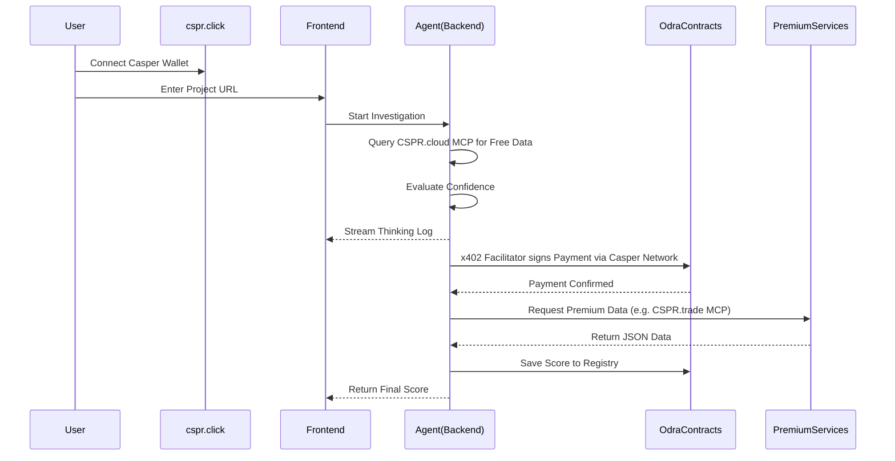

# Architecture Overview

The Sentinel AI project is composed of three main layers that interact to provide an autonomous due diligence service. We leverage the official Casper Developer Toolkits to provide a native, scalable ecosystem experience.

## 1. Frontend (Next.js & TailwindCSS)
The user interface layer.
- **cspr.click Integration**: Users authenticate and connect their Casper Wallet seamlessly using `cspr.click`.
- **Project Input**: A simple interface for users to submit a project URL or smart contract address.
- **Live Thinking Log**: Connects to the backend (via WebSocket or Server-Sent Events) to stream the AI agent's internal monologue.
- **Results Dashboard**: Displays the final Investment Score and risks.
- **CSPR.cloud MCP**: Used to quickly fetch transaction histories and verify on-chain metadata for the dashboard.

## 2. Backend & Agent Orchestrator (Node.js / LangChain)
The "brain" of Sentinel AI.
- **ReAct Loop**: Implements the Reasoning and Acting paradigm. 
- **Tools**:
  - `BuyPremiumServiceTool`: The agent calls this tool. This tool signs and broadcasts a transaction to the Casper Testnet, triggering an x402 payment to the Odra smart contract.

## 3. Smart Contracts (Odra Framework SKILL)
The decentralized trust layer built using the **Odra** smart contract framework for maximum security and ease of development.
- **ServiceMarketplace Module**: 
  - Allows data providers to register their services.
  - Handles the x402 payment logic via the **x402 Facilitator**.
- **InvestigationRegistry Module**:
  - Acts as an immutable ledger of all investigations.

## Data Flow

